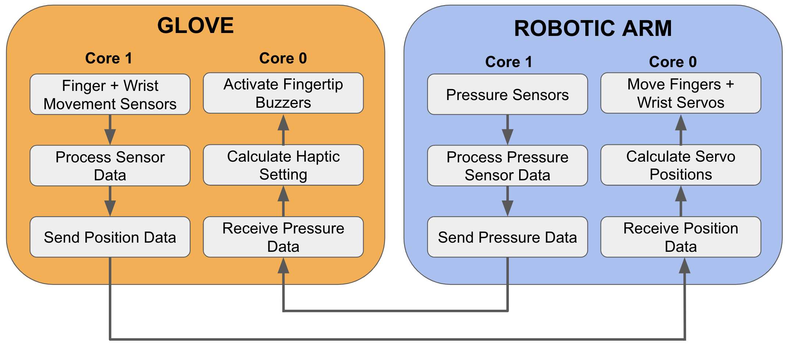
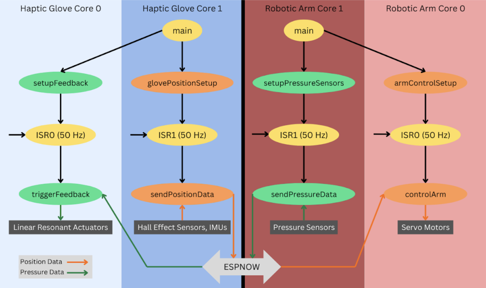

# Firmware

The Dexterity system consists of a haptic control glove and robotic arm that work together to enable remote manipulation of objects. The system uses ESP-NOW wireless communication to transmit position and force feedback data between the glove and arm with low latency.

## System Architecture

The ESP32's dual-core architecture enables parallel processing of haptic feedback and position control. Core 1 handles initialization, with FreeRTOS managing resource allocation across both cores. The pressure sensor-to-LRA feedback pipeline runs on one core, while position sensing-to-servo control runs on the other. Timer-based ISRs ensure 50 Hz processing rates for both pipelines. The system uses ESP-NOW for wireless communication, with pressure data categorized into five intensity levels for haptic feedback, and position data from Hall Effect sensors and IMUs controlling servo movements.

## HapticGlove
Firmware for the V2 control glove. The glove uses hall-effect sensors and IMUs to track finger and wrist movements, which are processed and sent wirelessly to control the robotic arm. It receives pressure sensor data from the arm and provides haptic feedback through LRA vibration motors on the fingertips. Descriptions of each library can be found here: [HapticGlove Libraries](HapticGlove/lib/)

## RoboticArm 
Firmware for the robotic hand. The arm receives position commands from the glove and moves its servos to match the user's movements. It uses pressure sensors to detect contact forces and sends this data back to drive the glove's haptic feedback. Descriptions of each library can be found here: [RoboticArm Libraries](RoboticArm/lib/)

## PrototypeGlove
Firmware for the initial prototype control glove used for testing and development. Descriptions of each library can be found here: [PrototypeGlove Libraries](PrototypeGlove/lib/)

## ESPNOW
Example implementations and testing code for ESP-NOW wireless communication between devices.

## test
Various test implementations and debugging tools for development and validation.

