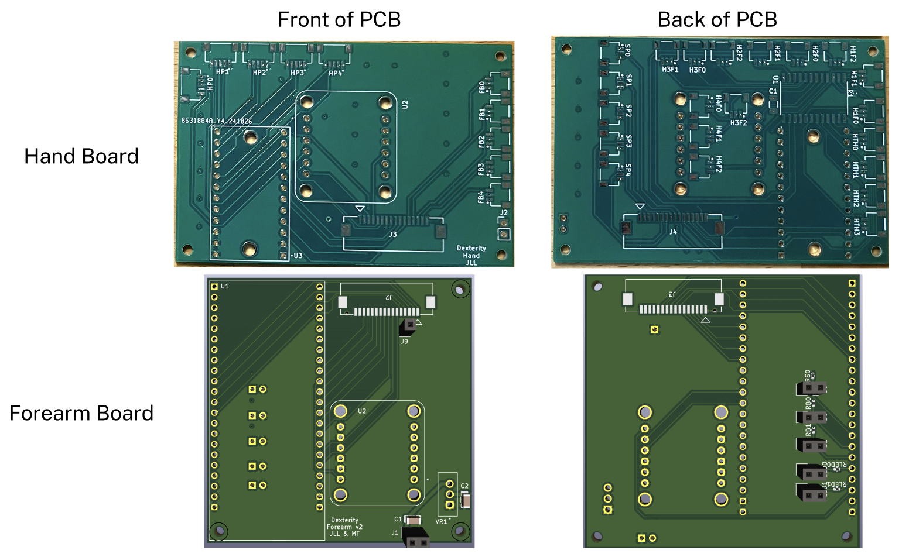

# Hardware

This directory contains the hardware design files for the project, organized into three main sections:

## BOM (Bill of Materials)
The Project Dexterity BOM excel spreadsheet (also available as a [google sheet](https://docs.google.com/spreadsheets/d/1TfbwuFHU-D9O60yxQ3oRrJCOd3qs4ftfMmc7sZDtarE/edit?usp=sharing)) contains part lists organized into 3 sheets: 
- Robotic Arm BOM
- Control Glove BOM
- General BOM

## CAD (Computer-Aided Design)
The CAD directory contains 3D models and mechanical design files for the physical components of the project. The models were designed in SolidWorks and are avaiable as SLDPRT files. Each folder contains a folder with all the STLs as well.
- `arm base/` - CAD files for the arm base and wire organization
- `glove v2.4/` - CAD files for the latest interation of the V2 glove
- `old/` - CAD files for the previous iterations of the V2 glove

## PCB (Printed Circuit Board)
The PCB directory contains the electronic design files for the circuit boards. These include:
- `Forearm/` - PCB design files for the forearm
- `Hand/` - PCB design files for the hand
- `Library/` - KiCad library files
- `gerber/` - Gerber files for manufacturing

We ordered the PCBs from [JLCPCB](https://jlcpcb.com/). Pictures of the PCBs are below:

